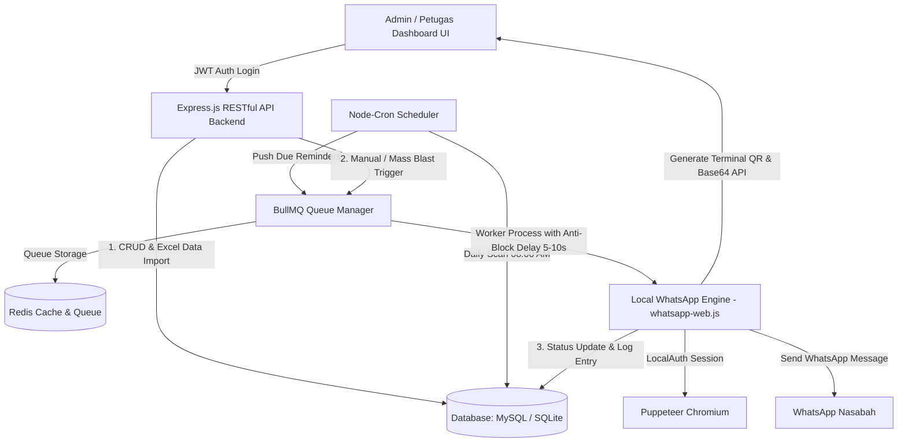

# 🚀 Backend Service: Web Blast Pesan Pengingat Pembayaran (Upgrade Pegadaian)

**Sistem Otomatisasi Pengingat Jatuh Tempo Pembayaran Gadai Berarsitektur Asynchronous & Queue-Based**  
**Lokasi**: Pegadaian Gorontalo Cabang Sentral  
**Author / Developer**: **BieM363** (GitHub: [BieM363](https://github.com/BieM363))  
**Repository Frontend**: [magang-Pegadaian-frontend](https://github.com/BieM363/magang-Pegadaian-frontend)

---

## 📌 Tujuan Upgrade Systems
Memodernisasi dan mentransformasi proses bisnis pengingat jatuh tempo pembayaran gadai di Pegadaian Gorontalo Sentral dari sistem lama (*WA Blast/Bulk WhatsApp manual* yang kurang filter, tidak ada pelacakan status terkirim, dan berisiko kebocoran data) menjadi sistem **RESTful API terstruktur, otomatis, aman (JWT + Bcrypt), dan berarsitektur Queue-based (BullMQ + Redis)**.

---

## 🛠️ Tech Stack & Dependencies

- **Backend Runtime**: Node.js & Express.js RESTful API
- **Database & Migration**: SQLite / MySQL (Knex.js ORM with auto-schema migration)
- **Cache & Message Queue**: Redis & BullMQ (plus resilient built-in local queue fallback)
- **Local WhatsApp Integration**: `whatsapp-web.js` + `qrcode-terminal` + `LocalAuth` (100% Localhost tanpa bayar API Gateway/Hosting)
- **Otentikasi & Keamanan**: JWT (JSON Web Token), Bcrypt Password Hashing, & Personal Access Tokens
- **Task Scheduler**: Node-Cron (Daily automated scanner)
- **Export & Import Engine**: ExcelJS / XLSX & jsPDF
- **Frontend Stack**: HTML5, Vanilla CSS, JavaScript (jQuery, Bootstrap, AJAX)

---

## 🏗️ Arsitektur Antrean & Transmisi Data (BullMQ + Redis)

Sistem mengadopsi alur **Event-Driven / Queue-Based Development** di mana data pengingat bertransisi secara bertahap:  
`Pending` $\rightarrow$ `In-Queue` $\rightarrow$ `Sent` / `Failed`.



---

## 🗄️ Database Schema (Sesuai Laporan Magang Pegadaian)

| Tabel | Deskripsi & Fields Utama |
|---|---|
| **`users`** | `id`, `name`, `email`, `username`, `password` (bcrypt), `role`, `created_at`, `updated_at` |
| **`reminders`** | `id`, `no_surat`, `name`, `phone` (format 62), `item`, `amount`, `due_date`, `send_date`, `status` (`pending`, `queued`, `sent`, `failed`) |
| **`messages`** | `id`, `reminder_id`, `message_text`, `status`, `sent_at`, `error_message`, `created_at` |
| **`reminders_status`** | `id`, `reminder_id`, `status`, `log_time`, `note` |
| **`personal_access_tokens`** | `id`, `user_id`, `token`, `expires_at`, `created_at` |
| **`message_templates`** | `id`, `title`, `template_body`, `is_active`, `created_at`, `updated_at` |

---

## 🔑 Fitur Utama Backend & Frontend

1. **Authentication & Profile Management (JWT)**: Login Admin terenkripsi Bcrypt dengan token JWT dan tabel `personal_access_tokens`, serta endpoint update profil petugas `/api/users/profile`.
2. **Localhost WhatsApp Engine**: Inisialisasi sesi WhatsApp Puppeteer lokal via `whatsapp-web.js`, visualizer QR Code di terminal & dashboard UI, serta sesi terenkripsi via `LocalAuth`.
3. **Message Queue & Anti-Block Mechanism**: Memproses blasting pesan secara asynchronous melalui antrean BullMQ + Redis dengan jeda acak (delay 5–10 detik per pesan) untuk mencegah pembatasan akun.
4. **Automated Task Scheduler (Node-Cron)**: Penjadwalan harian otomatis di server (Pukul 08:00 AM) yang memindai tanggal jatuh tempo transaksi nasabah.
5. **Data Management & Dynamic Search Filtering**: CRUD Data Nasabah dengan fitur pencarian dinamis berdasarkan Nama, Tanggal Jatuh Tempo, dan Status Pengiriman.
6. **Import/Export Excel & Dynamic Message Template**: Unggah massal Excel, ekspor laporan blasting Excel/PDF, serta kustomisasi template pesan otomatis dengan placeholder (`*nama*`, `*barang*`, `*harga*`, `*tanggal*`, `*nosurat*`).

---

## 💻 Panduan Instalasi & Eksekusi Localhost

### 1. Prasyarat Lingkungan
- Node.js (v16.x atau v18.x+)
- Redis Server (Opsional untuk BullMQ, jika offline sistem otomatis beralih ke Resilient Built-in Queue)

### 2. Langkah Eksekusi Backend Service

```bash
# 1. Masuk ke direktori backend
cd backend

# 2. Install semua dependensi
npm install

# 3. Salin environment file
cp .env.example .env

# 4. Jalankan Seed Data Sampel (Opsional)
npm run seed

# 5. Jalankan Backend RESTful API Server
npm start
```

Server backend akan berjalan secara otomatis di: **`http://localhost:3000`**

### 3. Login Credentials Default
- **Username**: `admin123`
- **Password**: `08`

---

## 📡 Ringkasan API Endpoints Reference

### Authentication API
- `POST /api/auth/login` - Authenticate Admin & Get JWT Token
- `GET /api/auth/me` - Get Current Logged Admin Profile
- `POST /api/auth/logout` - Revoke Token & Session Logout

### WhatsApp Engine API
- `GET /api/whatsapp/status` - Get Connection Status & QR Code Base64 Data URL
- `POST /api/whatsapp/init` - Initialize WhatsApp Engine & Puppeteer
- `POST /api/whatsapp/logout` - Terminate Local Sesi WhatsApp

### Reminders & Blasting API
- `GET /api/reminders` - Fetch Reminders (Query Params: `search`, `dueDate`, `status`)
- `POST /api/reminders` - Create Single Customer Reminder
- `PUT /api/reminders/:id` - Update Customer Reminder Record
- `DELETE /api/reminders/:id` - Delete Customer Reminder Record
- `POST /api/reminders/blast` - Trigger Mass WhatsApp Blasting Queue
- `POST /api/reminders/import-excel` - Mass Upload Excel File (.xlsx/.xls)
- `GET /api/reminders/export-excel` - Export Blasting Report Excel

---

## 📸 WhatsApp Scanning & Blasting Terminal Workflow

 Saat server pertama kali dijalankan, QR Code akan tercetak otomatis di **Terminal Log**:

```
======================================================
📲 SCAN QR CODE BELOW WITH YOUR WHATSAPP APP (PEGADAIAN)
======================================================

▄▄▄▄▄▄▄▄▄▄▄▄▄▄▄▄▄▄▄▄▄▄▄▄▄▄▄▄▄▄▄
█ ▄▄▄▄▄ █▀▄█ █▄ █ ▄ █ ▄▄▄▄▄ █
█ █   █ █  ▀▀ ▄█ ▀▀▀█ █   █ █
█ █▄▄▄█ █▀▀ █ █ ▀ ▀ █ █▄▄▄█ █
█▄▄▄▄▄▄▄█▄█▄█▄█▄█▄█▄█▄▄▄▄▄▄▄█
```

Atau buka dashboard pada browser di `http://localhost:3000/dashboard.html` untuk memindai QR Code via antarmuka UI.

---

**Developed & Upgraded with ❤️ for Pegadaian Gorontalo Sentral by BieM363.**
